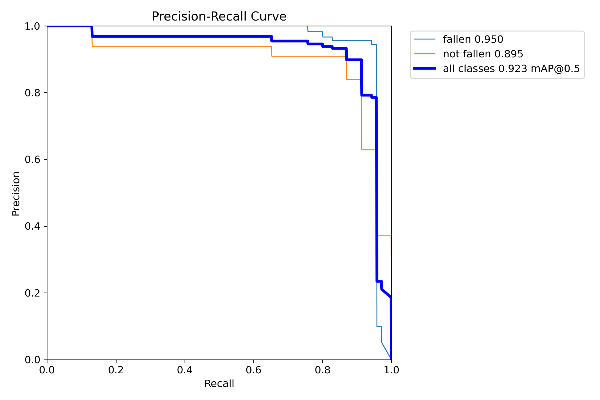
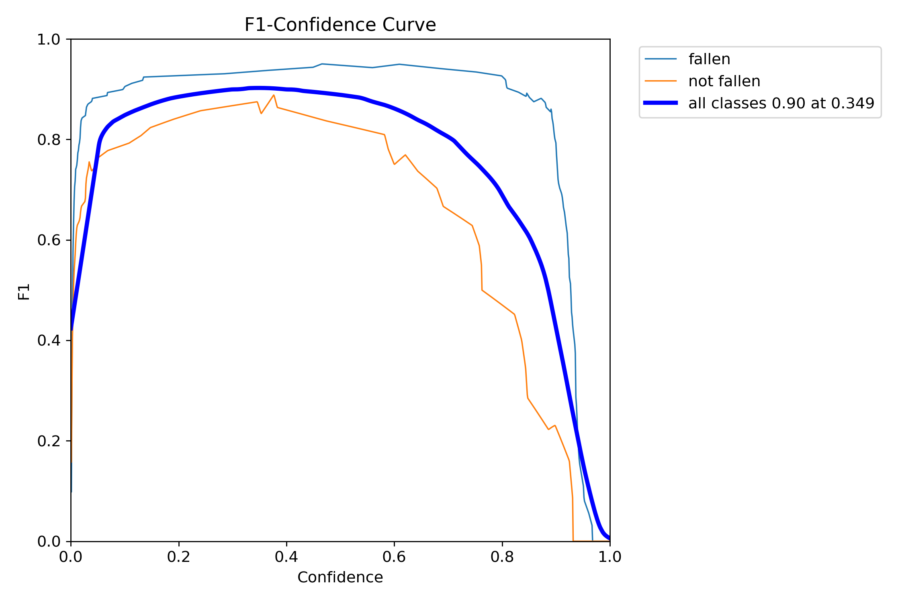
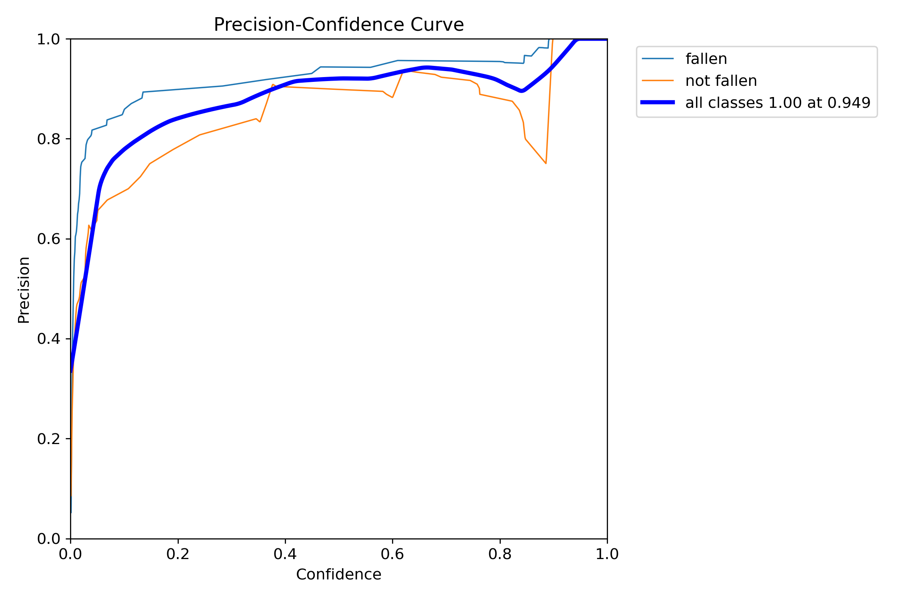
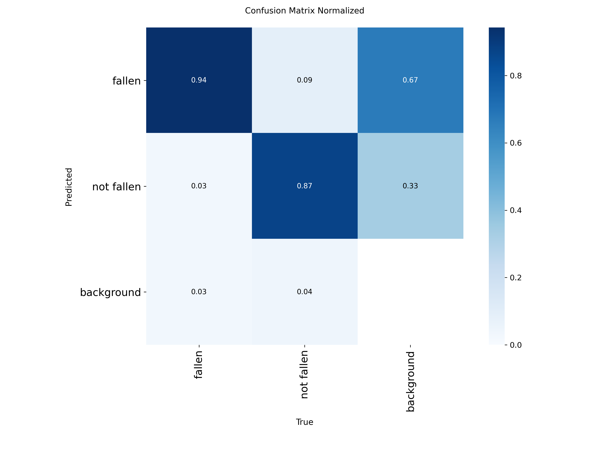
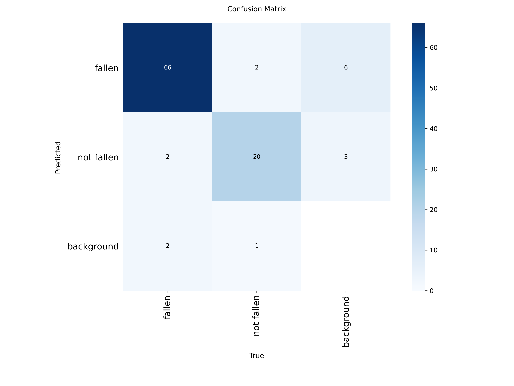

# Memoria: The Dementia Assistant

Memoria is an intelligent dementia assistance system designed to improve safety and accessibility for users. It combines computer vision for fall detection with a smart conversational agent ("Jeeves") that can help locate lost objects and recall past activities.

.gif)


## Features

- **Fall Detection**: Real-time monitoring using a custom YOLOv11 model. Detects falls with a stability buffer (3.5s) to reduce false positives and sends immediate email alerts with attached event screenshots to caregivers.
  
  <p align="center">
    
  </p>

- **Smart Assistant (Jeeves)**: A unified "Manager" agent that orchestrates specialized tools:
  - **Object Detector**: Locates lost items (e.g., "Where are my keys?") and returns visual context with highlighted images.
  
  <p float="left">
    
    
  </p>

  - **Time Agent**: Tracks presence and conversations. Can answer "What did I do yesterday?", "What was I talking about?" (transcripts), or check specific rooms (e.g., "Was I in the kitchen?"). Powered by MongoDB for event storage.

- **Video & Audio Recording**: Smart buffering records events of interest .


## Performance Evaluation : YOLO Model

### Precision-Recall Curve

- mAP@0.5: 0.923
- Fallen detection mAP: 0.950
- Not fallen detection mAP: 0.895

### F1-Confidence Curve

- Best F1 score: 0.90 at confidence 0.349

### Precision-Confidence Curve

- Precision reaches 1.00 at confidence 0.949

### Confusion Matrix


- Fallen detection accuracy: 94%
- Not fallen detection accuracy: 87%


## Architecture


## Prerequisites

- **Python 3.10+**
- **MongoDB**: Required for the Time Agent to store and retrieve activity history.
- **Webcam**: For fall detection and object search.
- **API Keys**:
  - OpenAI API Key (for Jeeves/LLM reasoning)
  - Google Gemini API Key (for video content analysis)
  - Google Cloud Credentials (for Gmail alerts & Drive upload)

## Setup Instructions

### 1. Clone the Repository
```bash
git clone <repository-url>
cd Blue-Dream
```

### 2. Install Dependencies
```bash
pip install -r requirements.txt
```

### 3. SAM3 API Setup
For the Segment Anything Model 3 (SAM3) API setup, please refer to the official SAM3 repository for installation and configuration instructions:
**[https://github.com/facebookresearch/sam3](https://github.com/facebookresearch/sam3)**

### 4. Database Setup
Ensure **MongoDB** is installed and running locally on the default port (`27017`). The Time Agent connects to `mongodb://localhost:27017` by default.

### 5. Configuration
1.  **Environment Variables**: Create a `.env` file in the root directory:
    ```ini
    OPENAI_API_KEY=your_openai_key
    GOOGLE_API_KEY=your_gemini_key
    MONGODB_URI=mongodb://localhost:27017 (Optional, defaults to local)
    ```
2.  **Google Credentials**: Place your `credentials.json` file in `Blue_dream_agents/Tools/` to enable Gmail alerts and Drive integration.

## Running the Project

### 1. Start the Backend API (Jeeves)
This runs the FastAPI server that powers the smart assistant and serves the UI.
```bash
uvicorn Blue_dream_agents.api:app --reload
```
*The API will be available at `http://localhost:8000`*

### 2. Start the Camera Feed
This launches the computer vision system for fall detection and recording.
```bash
python Capture/camera_feed.py
```
*Press 'q' to quit the camera feed.*

### 3. Access the User Interface
Open your web browser and navigate to:
[http://localhost:8000](http://localhost:8000)

## Directory Structure

- **Blue_dream_agents/**: Core logic for Jeeves, Time Agent, and API.
- **Blue_dream_agents/Tools/**: Utilities for email (GmailAgent) and integrations.
- **Capture/**: Computer vision scripts (`camera_feed.py`), YOLO models, and recording logic.
- **UI/**: Frontend web interface.
- **Storage/**: Local storage for recordings and screenshots.


## TODO

- [ ] Add Facial Recognition
- [ ] Make an improved Semantic Search System 
- [ ] Build a Video Parser not dependent on Google Gemini's 20 video limit
- [ ] Build a faster Segmentation Model as an alternative to SAM3
- [ ] Live Feed